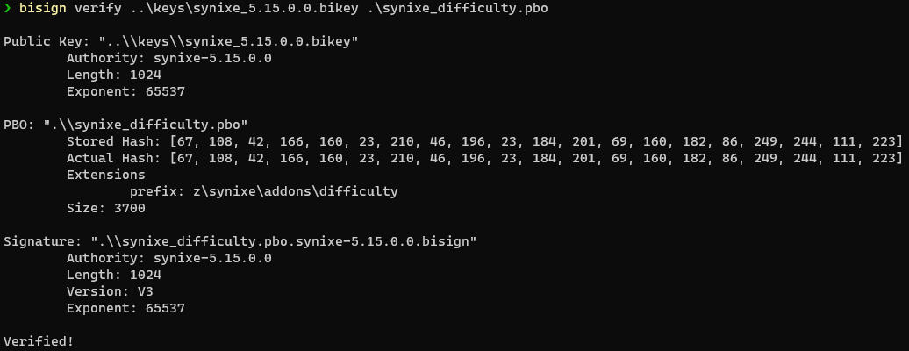

# BISign - Signature Tool for Bohemia Interactive PBOs

Create keys and signatures, and verify PBO's with more accuracy that DSUtils.

DSUtils currently is missing checks that Arma 3 has, this tool is able to verify keys in the same way that Arma 3 does.

## Note

This repo is just a wrapper around [hemtt-sign](https://github.com/brettmayson/hemtt) so it can be released invidually.

